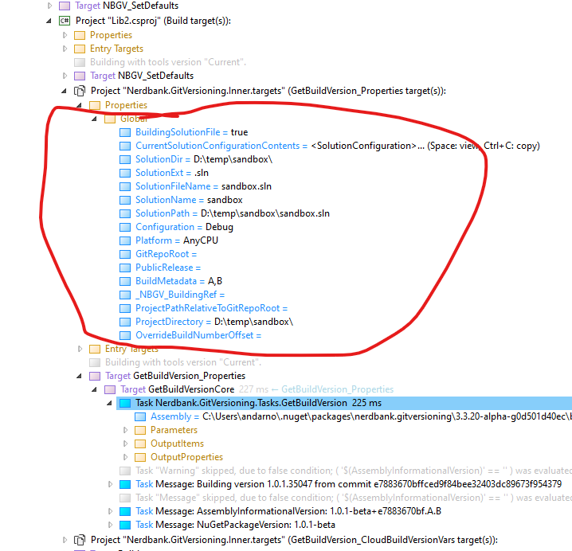

# MSBuild

Installing the `Nerdbank.GitVersioning` package from NuGet into your MSBuild-based projects is the recommended way to add version information to your MSBuild project outputs including assemblies, native dll's, and packages.

## Public releases

By default, each build of a Nuget package will include the git commit ID.
When you are preparing a release (whether a stable or unstable prerelease),
you may build setting the `PublicRelease` global property to `true`
in order to avoid the git commit ID being included in the NuGet package version.

From the command line, building a release version might look like this:

```ps1
msbuild /p:PublicRelease=true
```

Note you may consider passing this switch to any build that occurs in the
branch that you publish released NuGet packages from.
You should only build with this property set from one release branch per
major.minor version to avoid the risk of producing multiple unique NuGet
packages with a colliding version spec.

## Build performance

Repos with many projects or many commits between major/minor version bumps can suffer from compromised build performance due to the MSBuild task that computes the version information for each project.
You can assess the impact that Nerdbank.GitVersioning has on your build time by running a build with the `-clp:PerformanceSummary` switch and look for the `Nerdbank.GitVersioning.Tasks.GetBuildVersion` task.

### Reducing `GetBuildVersion` invocations

If the `GetBuildVersion` task is running many times, yet you have just one (or a few) `version.json` files in your repository, you can reduce this task to being called just once per `version.json` file to *significantly* improve build performance.
To do this, drop a `Directory.Build.props` file in the same directory as your `version.json` file(s) with this content:

```xml
<Project>
  <PropertyGroup>
    <GitVersionBaseDirectory>$(MSBuildThisFileDirectory)</GitVersionBaseDirectory>
  </PropertyGroup>
</Project>
```

This MSBuild property instructs all projects in or under that directory to share a computed version based on that directory rather than their individual project directories.
Check the impact of this change by re-running MSBuild with the `-clp:PerformanceSummary` switch as described above.

If you still see many invocations, you may have a build that sets global properties on P2P references.
Investigate this using the MSBuild `/bl` switch and view the log with the excellent [MSBuild Structured Log Viewer](https://msbuildlog.com) tool.
Using that tool, search for `$task GetBuildVersion` and look at the global properties passed to the special `Nerdbank.GitVersioning.Inner.targets` project, as shown:

[

Compare the set of global properties for each `Nerdbank.GitVersioning.Inner.targets` project to identify which properties are unique each time.
Add the names of the unique properties to the `Directory.Build.props` file:

```xml
<Project>
  <PropertyGroup>
    <GitVersionBaseDirectory>$(MSBuildThisFileDirectory)</GitVersionBaseDirectory>
  </PropertyGroup>
  <ItemGroup>
    <NBGV_GlobalPropertiesToRemove Include="ChangingProperty1" />
    <NBGV_GlobalPropertiesToRemove Include="ChangingProperty2" />
  </ItemGroup>
</Project>
```

That should get you down to one invocation of the `GetBuildVersion` task per `version.json` file in your repo.
